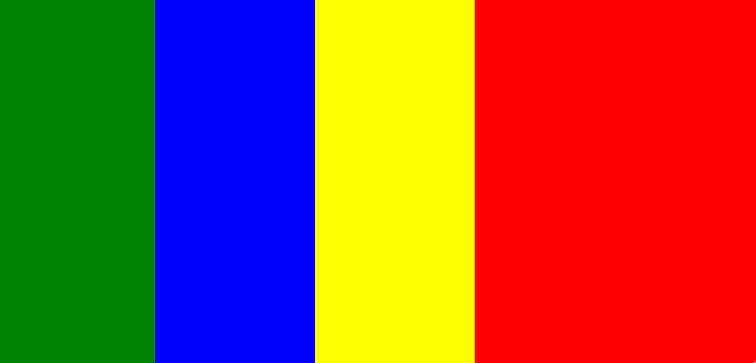

# Box

## GtkBox Widget Overview - GTK 4

The `GtkBox` widget in GTK 4 is a container for arranging child widgets in a linear manner, either horizontally or vertically. It's a fundamental element in creating GUI layouts, offering flexibility and control over the presentation and arrangement of child widgets.

## Basic Characteristics

- **Orientation**: Configurable as horizontal or vertical, determining the linear arrangement of child widgets.
- **Homogeneous Sizing**: Ability to make all child widgets the same size or allow them to differ.

## Widget Packing and Management

- **Appending**: Add widgets to the end of the box.
- **Removal**: Remove widgets from the box.
- **Insertion**: Insert widgets at specific positions.
- **Reordering**: Adjust the order of child widgets within the box.

## Layout and Spacing

- **Homogeneous Property**: Set whether children have equal size.
- **Spacing**: Control the space between child widgets.
- **Alignment**: Align child widgets using horizontal and vertical alignment properties.

## Use Cases

- **UI Layout**: Arrange buttons, toolbars, and other elements in a user interface.
- **Spacing and Alignment**: Control the distribution and alignment of widgets within a container.

## Usage

- Utilized in a variety of GUI applications for orderly and visually consistent layouts.
- Flexibility in arranging widgets either in rows or columns based on the set orientation.

```ts
import { Box,Label } from '@react-gtk/core';

export function BoxDemo(){
  return (
    <Box>
       <Label label="box demo"/>
    </Box>

    <Box>
       <Label label="box demo2"/>
    </Box>

    <Box>
       <Label label="box demo3"/>
    </Box>
  )
}
```

**Result**



## Properties and Definitions

- **accessibleRole**: Accessibility role of the widget.
- **baselinePosition**: Baseline position for alignment.
- **canFocus**: If the widget can receive keyboard focus.
- **canTarget**: Drag-and-drop target capability.
- **cssClasses**: CSS classes for styling.
- **cssName**: CSS name for styling.
- **cursor**: Type of cursor on hover.
- **focusOnClick**: Focus on click.
- **focusable**: Whether it's focusable via keyboard.
- **gTypeInstance**: GObject type system property.
- **halign**: Horizontal alignment within its allocation.
- **hasDefault**: If the widget is a default activation widget.
- **hasFocus**: Current focus state.
- **hasTooltip**: If a tooltip is set.
- **heightRequest**: Requested widget height.
- **hexpand**: Horizontal expansion.
- **hexpandSet**: If horizontal expansion is set.
- **homogeneous**: Equal sizing of children.
- **layoutManager**: Layout manager for child widgets.
- **margin properties**: Margins around the widget.
- **name**: Widget identification name.
- **opacity**: Opacity level.
- **orientation**: Arrangement direction of children.
- **overflow**: Overflow handling.
- **parent**: Parent widget reference.
- **parentInstance**: GObject parent instance.
- **receivesDefault**: Default activation state.
- **root**: Root widget in the hierarchy.
- **scaleFactor**: Scaling for high-resolution displays.
- **sensitive**: Response to user input.
- **spacing**: Space between children.
- **tooltip properties**: Tooltip text and markup.
- **valign**: Vertical alignment within its allocation.
- **vexpand**: Vertical expansion.
- **vexpandSet**: If vertical expansion is set.
- **visible**: Visibility state.
- **widthRequest**: Requested widget width.
- **$gtype, name**: Internal GObject properties.
