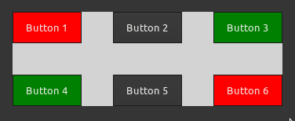

# Button

## Overview of Button in GTK 4

The GtkButton widget in React GTK 4 is a versatile component designed to trigger a callback function upon button press. It stands out for its ability to accommodate any valid child widget, allowing for the inclusion of a wide range of standard GtkWidget elements. Typically, the GtkLabel is the preferred child widget within a GtkButton.

This widget simplifies the creation of interactive buttons in GTK 4 applications developed with React, making it a fundamental building block for user interfaces.

### Usage

To use the GtkButton widget in React GTK 4, follow the example below:

```ts
import { Button } from '@react-gtk/core';

function MyButton() {
  return (
    <Button label="Click me" onClick={() => console.log('Button clicked!')} />
  );
}

```

In this example, we import the Button component from @react-gtk/core and create a button with the label "Click me" and an onClick event handler to handle button clicks.

```ts
import { Box,Button } from '@react-gtk/core';

export function ButtonDemo(){
return (
    <Box
      style={{
        backgroundColor: 'lightgray',
      }}
    >
      <Button label="Button 1" />
      <Button label="Button 2" />
      <Button label="Button 3" />
    </Box>
  );
}
```

**Result**



---

_This document provides a brief overview of GtkButton in GTK 4 and its integration with React Native GTK4 for building native GTK4 applications using React._

## Properties

List of properties associated with the GtkButton widget:

- `accessibleRole`: Role for accessibility.
- `actionName`: Name of the action associated with the button.
- `actionTarget`: Target of the action.
- `canFocus`: Whether the widget can receive focus.
- `canTarget`: Whether the widget can receive target events.
- `child`: Child widget of the button.
- `cssClasses`: CSS classes applied to the widget.
- `cssName`: CSS name of the widget.
- `cursor`: Cursor used by the widget.
- `focusOnClick`: Whether the widget should grab focus when clicked.
- `focusable`: Whether the widget is focusable.
- `gTypeInstance`: Instance of the GType.
- `halign`: Horizontal alignment of the widget.
- `hasDefault`: Whether the widget is a default widget.
- `hasFocus`: Whether the widget has focus.
- `hasFrame`: Whether the button has a frame.
- `hasTooltip`: Whether the widget has a tooltip.
- `heightRequest`: Requested height of the widget.
- `hexpand`: Whether the widget should expand horizontally.
- `hexpandSet`: Whether to use the `hexpand` property.
- `iconName`: Icon name used in the button.
- `label`: Text of the label inside the button.
- `layoutManager`: Layout manager of the widget.
- `marginBottom`: Margin at the bottom of the widget.
- `marginEnd`: Margin at the end of the widget.
- `marginStart`: Margin at the start of the widget.
- `marginTop`: Margin at the top of the widget.
- `name`: Name of the widget.
- `opacity`: Requested opacity of the widget.
- `overflow`: How content outside the widget’s content area is treated.
- `parent`: Parent widget.
- `parentInstance`: Instance of the parent.
- `receivesDefault`: Whether the widget receives the default action.
- `root`: Root widget of the widget tree.
- `scaleFactor`: Scale factor of the widget.
- `sensitive`: Whether the widget responds to input.
- `tooltipMarkup`: Markup text for the tooltip.
- `tooltipText`: Text for the tooltip.
- `useUnderline`: Whether to use underlines for mnemonics.
- `valign`: Vertical alignment of the widget.
- `vexpand`: Whether the widget should expand vertically.
- `vexpandSet`: Whether to use the `vexpand` property.
- `visible`: Whether the widget is visible.
- `widthRequest`: Requested width of the widget.
- `$gtype`: GType of the widget.
- `name`: Name of the widget.

---
