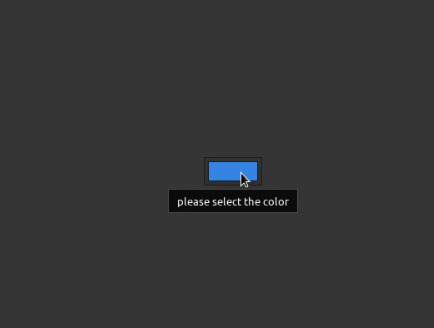
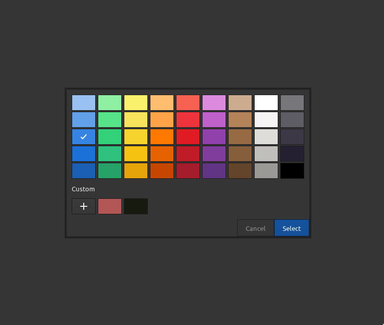

# ColorButton

## Overview

The `ColorButton` component in `React-GTK` seamlessly integrates with `GTK4`, providing a user-friendly button for selecting colors. It extends GTK4's `Gtk.ColorButton` functionality and allows users to interactively choose colors within React applications.

## Usage

The `ColorButton` component in React-GTK extends GTK4's `Gtk.ColorButton`, inheriting from the `Element` class. It accepts properties from `StyleProps` and `ColorButtonGObjectProps`, offering customization options for appearance and behavior. The standard React `children` prop allows the inclusion of additional nodes or components within the color button.

```jsx
import React from 'react';
import { Box, Label, ColorButton } from '@react-gtk/core';
import Gtk from '@girs/node-gtk-4.0';

export const ColorButtonDemo = () => {
  return (
    <Box valign={Gtk.Align.CENTER} halign={Gtk.Align.CENTER}>
      <ColorButton style={{ width: 70 }} tooltipText="please select the color" />
    </Box>
  );
};

export default ColorButtonDemo;
```

## Result




## ColorButton Properties

- **accessibleRole**: Specifies the accessible role of the color button for accessibility purposes.
- **canFocus**: Indicates whether the color button can receive keyboard focus.
- **canTarget**: Indicates whether the color button can be a target for other widgets.
- **cssClasses**: CSS classes applied to the color button for styling.
- **cssName**: The CSS name of the color button.
- **cursor**: The cursor to be displayed when hovering over the color button.
- **focusOnClick**: Determines if the color button should grab focus when clicked.
- **focusable**: Indicates whether the color button is focusable.
- **gTypeInstance**: The underlying GObject type instance.
- **halign**: Horizontal alignment of the color button's contents.
- **hasDefault**: Indicates whether the color button is the default widget within its parent.
- **hasFocus**: Indicates whether the color button currently has focus.
- **hasTooltip**: Determines if the color button has an associated tooltip.
- **heightRequest**: Specifies the preferred height of the color button.
- **hexpand**: Whether the color button expands horizontally to fill available space.
- **hexpandSet**: Indicates whether the horizontal expansion is explicitly set.
- **layoutManager**: The layout manager used to arrange child widgets.
- **marginBottom**: The margin at the bottom of the color button.
- **marginEnd**: The margin at the end (right in LTR, left in RTL) of the color button.
- **marginStart**: The margin at the start (left in LTR, right in RTL) of the color button.
- **marginTop**: The margin at the top of the color button.
- **modal**: Determines if the color selection dialog is modal.
- **name**: The name of the color button.
- **opacity**: The opacity level of the color button.
- **overflow**: Controls how content should be displayed when it overflows.
- **parent**: The parent container of the color button.
- **parentInstance**: The parent instance of the color button.
- **receivesDefault**: Determines if the color button should receive the default action when activated.
- **rgba**: The RGBA color value represented by the color button.
- **root**: The top-level parent container of the color button.
- **scaleFactor**: The scale factor applied to the color button's contents.
- **sensitive**: Indicates whether the color button responds to user input.
- **showEditor**: Determines if the color editor is visible.
- **title**: The title of the color selection dialog.
- **tooltipMarkup**: Markup text for the color button's tooltip.
- **tooltipText**: Plain text for the color button's tooltip.
- **useAlpha**: Determines if the alpha channel is used in the color selection.
- **valign**: Vertical alignment of the color button's contents.
- **vexpand**: Whether the color button expands vertically to fill available space.
- **vexpandSet**: Indicates whether the vertical expansion is explicitly set.
- **visible**: Determines if the color button is visible.
- **widthRequest**: Specifies the preferred width of the color button.
- **$gtype**: The GObject type of the color button.
- **name**: The name of the color button.
