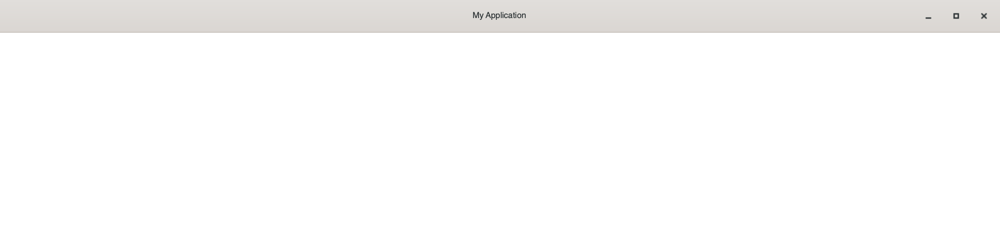

# HeaderBar

## Overview for GtkHeaderBar in Gtk4

The GtkHeaderBar widget in React GTK 4 is a customizable container that can hold a variety of widgets, such as buttons and title widgets. It is typically used as a top-level element in windowed applications and provides a modern, integrated look for the title bar.

This widget offers an intuitive way to design and manipulate the header bar of your applications, enhancing the overall user experience in GTK 4 applications built with React.

## Usage
A simple example to demonstrate how to use the HeaderBar widget in React GTK 4:

```jsx

import React from 'react';
import Gtk from '@girs/node-gtk-4.0';
import { HeaderBar, Box } from '@react-gtk/core';

function App() {
  return (
    <Box style={{ backgroundColor: 'white' }}>
      <HeaderBar
        titleWidget={new Gtk.Label({ label: 'My Application' })}
        showTitleButtons={true}
        decorationLayout="icon:minimize,maximize,close"
        valign={Gtk.Align.START}
        visible={true}
        hexpand
      />
    </Box>
  );
}

export default App;

```

**Result**



## Properties

List of properties associated with the GtkHeaderBar widget:

- accessible_role: The role of the widget in accessibility applications.
- can_focus: Whether the widget can receive focus.
- can_target: Indicates if the widget can be a target for drag-and-drop operations.
- css_classes: A list of CSS classes applied to the widget for styling.
- css_name: The CSS name used for styling the widget.
- cursor: The type of cursor displayed when hovering over the widget.
- decoration_layout: Layout of window control buttons (like minimize, maximize, close).
- focus_on_click: Whether the widget grabs focus when clicked.
- focusable: Determines if the widget can be focused via keyboard navigation.
- g_type_instance: Instance of GObject's type system for this widget.
- halign: Horizontal alignment of the widget within its container.
- has_default: Indicates if the widget is the default widget within its top-level.
- has_focus: Shows if the widget currently has focus.
- has_tooltip: Determines if the widget has a tooltip.
- height_request: The desired height of the widget.
- hexpand: Whether the widget should expand horizontally within its container.
- hexpand_set: Whether the hexpand property has been explicitly set.
- layout_manager: Manages the layout of child widgets.
- margin_bottom: Bottom margin of the widget.
- margin_end: Right (or left in RTL languages) margin of the widget.
- margin_start: Left (or right in RTL languages) margin of the widget.
- margin_top: Top margin of the widget.
- name: A unique name for the widget.
- opacity: Transparency level of the widget.
- overflow: How content that doesn't fit in the widget is handled.
- parent: Reference to the widget's parent.
- parent_instance: Instance of the parent widget.
- receives_default: If true, the widget receives the default action when activated.
- root: The root widget in the widget hierarchy.
- scale_factor: Scaling factor for high DPI displays.
- sensitive: If true, the widget responds to user interactions.
- show_title_buttons: Determines whether to display title buttons like close, minimize, etc.
- title_widget: A custom widget used as the title of the header bar.
- tooltip_markup: Markup text for the widget's tooltip.
- tooltip_text: Plain text for the widget's tooltip.
- valign: Vertical alignment of the widget within its container.
- vexpand: Whether the widget should expand vertically within its container.
- vexpand_set: Whether the vexpand property has been explicitly set.
- visible: If true, the widget is visible.
- width_request: The desired width of the widget.
- $gtype: The GObject type identifier for the widget.
- name: (listed twice) A unique name for the widget, used for identification.

This guide provides a detailed look at the GtkHeaderBar in GTK 4 and its integration with React Native GTK4 for building native GTK4 applications using React.


