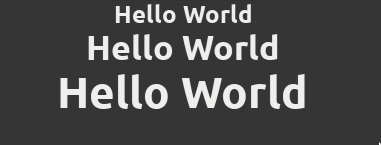

# Label

## overview

The `Label` component in React-GTK is a fundamental element for displaying text within your graphical user interface. It extends GTK4's label functionality and seamlessly integrates with React, providing a flexible and declarative approach to incorporating text content in your applications.

## Usage

The Label component inherits from the Element class in React-GTK, which, in turn, extends GTK4's Gtk.Label. It accepts various properties from both StyleProps and LabelGObjectProps, allowing developers to customize the appearance and behavior of the label. The Label component supports child elements through the standard React children prop, enabling you to include additional React nodes or components within the label.

```jsx
import React from 'react';
import { Label, Box } from '@react-gtk/core';

export const LabelDemo = () => {
  return (
    <Box>
      <Label label="Hello World" style={{ fontSize: '24px', fontWeight: '700' }} />
    </Box>
  );
};
```

## Result



## Properties

- **accessibleRole**: Specifies the accessible role of the label for accessibility purposes.
- **attributes**: Additional attributes associated with the label.
- **canFocus**: Indicates whether the label can receive keyboard focus.
- **canTarget**: Indicates whether the label can be a target for other widgets.
- **cssClasses**: CSS classes applied to the label for styling.
- **cssName**: The CSS name of the label.
- **cursor**: The cursor to be displayed when hovering over the label.
- **ellipsize**: Controls text truncation with an ellipsis if it overflows.
- **extraMenu**: Additional context menu items associated with the label.
- **focusOnClick**: Determines if the label should grab focus when clicked.
- **focusable**: Indicates whether the label is focusable.
- **gTypeInstance**: The underlying GObject type instance.
- **halign**: Horizontal alignment of the label's contents.
- **hasDefault**: Indicates whether the label is the default widget within its parent.
- **hasFocus**: Indicates whether the label currently has focus.
- **hasTooltip**: Determines if the label has an associated tooltip.
- **heightRequest**: Specifies the preferred height of the label.
- **hexpand**: Whether the label expands horizontally to fill available space.
- **hexpandSet**: Indicates whether the horizontal expansion is explicitly set.
- **justify**: Controls the justification of multi-line text within the label.
- **label**: The text content displayed by the label.
- **layoutManager**: The layout manager used to arrange child widgets.
- **lines**: The number of lines to display.
- **marginBottom**: The margin at the bottom of the label.
- **marginEnd**: The margin at the end (right in LTR, left in RTL) of the label.
- **marginStart**: The margin at the start (left in LTR, right in RTL) of the label.
- **marginTop**: The margin at the top of the label.
- **maxWidthChars**: The maximum number of characters to be displayed.
- **mnemonicKeyval**: The keyval of the mnemonic accelerator key.
- **mnemonicWidget**: The widget to activate when the label's mnemonic key is pressed.
- **name**: The name of the label.
- **naturalWrapMode**: Controls the line-wrapping of the label based on natural width.
- **opacity**: The opacity level of the label.
- **overflow**: Controls how text should be truncated or displayed when it overflows.
- **parent**: The parent container of the label.
- **parentInstance**: The parent instance of the label.
- **receivesDefault**: Determines if the label should receive the default action when activated.
- **root**: The top-level parent container of the label.
- **scaleFactor**: The scale factor applied to the label's contents.
- **selectable**: Indicates whether the text in the label is selectable.
- **sensitive**: Indicates whether the label responds to user input.
- **singleLineMode**: Determines if the label should be displayed as a single line.
- **tooltipMarkup**: Markup text for the label's tooltip.
- **tooltipText**: Plain text for the label's tooltip.
- **useMarkup**: Indicates whether the label interprets the text as markup.
- **useUnderline**: Determines if underlines in the text are treated as mnemonics.
- **valign**: Vertical alignment of the label's contents.
- **vexpand**: Whether the label expands vertically to fill available space.
- **vexpandSet**: Indicates whether the vertical expansion is explicitly set.
- **visible**: Determines if the label is visible.
- **widthChars**: The number of characters to use for calculating the preferred width.
- **widthRequest**: Specifies the preferred width of the label.
- **wrap**: Controls whether the label should wrap its text.
- **wrapMode**: The mode used for wrapping text within the label.
- **xalign**: Horizontal alignment of the label within its allocation.
- **yalign**: Vertical alignment of the label within its allocation.
- **$gtype**: The GObject type of the label.
- **name**: The name of the label.
