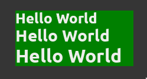

# Text

## Overview of Text in GTK 4

### Key Features

- **Single-line text entry**: GtkText is used for single-line text editing.
- **Common implementation**: Shared between GtkEntry, GtkPasswordEntry, GtkSpinButton, etc.
- **Key bindings**: Supports a large set of key bindings by default.
- **Scrolling**: Scrolls to keep the cursor position visible if text is longer than widget allocation.
- **Password mode**: Can display entered text as an invisible character for sensitive information.
- **Custom invisible character**: Allows customization of the invisible character used in password mode.
- **Alternatives**: For icons or progress in an entry, see GtkEntry. For multi-line text, see GtkTextView.

## Usage

To use the Text in React GTK 4, follow the example below:

```ts
import React from 'react';
import { Box, Text } from '@react-gtk/core';
import Gtk from '@girs/node-gtk-4.0';

export const TextDemo = () => {
  return (
    <Box>
      <Box
        orientation={Gtk.Orientation.VERTICAL}
        style={{ backgroundColor: 'green', width: 200 }}
        halign={Gtk.Align.CENTER}
        valign={Gtk.Align.CENTER}
        hexpand
      >
        <Text text="Hello World" style={{ fontSize: '24px', fontWeight: '700' }} />
        <Text text="Hello World" style={{ fontSize: '28px', fontWeight: '700' }} />
        <Text text="Hello World" style={{ fontSize: '32px', fontWeight: '700' }} />
      </Box>
    </Box>
  );
};
```

**Result**



## Properties with Definitions

- **accessibleRole**: Defines the accessibility role of the widget.
- **activatesDefault**: Determines whether the widget activates the default widget when Enter is pressed.
- **attributes**: Sets specific attributes for the text, like font and color.
- **buffer**: The text buffer that stores the displayed text.
- **canFocus**: Indicates whether the widget can receive input focus.
- **canTarget**: Determines if the widget can be a target for drag-and-drop operations.
- **cssClasses**: Custom CSS classes that can be added to the widget.
- **cssName**: The name used to refer to the widget in CSS.
- **cursor**: Defines the appearance of the text cursor.
- **cursorPosition**: The current position of the cursor in the text.
- **editable**: Specifies whether the text can be edited by the user.
- **enableEmojiCompletion**: Enables or disables emoji completion in the text.
- **enableUndo**: Enables or disables undo functionality.
- **extraMenu**: Custom context menu items that can be added to the widget.
- **focusOnClick**: Determines if the widget grabs focus when clicked.
- **focusable**: Indicates whether the widget can receive focus.
- **gTypeInstance**: The instance structure for the GObject type.
- **halign**: The horizontal alignment of the widget.
- **hasDefault**: Indicates if the widget is the default widget.
- **hasFocus**: Indicates if the widget currently has input focus.
- **hasTooltip**: Specifies whether the widget has a tooltip.
- **heightRequest**: The desired height of the widget.
- **hexpand**: Specifies whether the widget should expand horizontally.
- **hexpandSet**: Indicates whether the horizontal expansion has been explicitly set.
- **imModule**: The input method module used for the widget.
- **inputHints**: Hints for the text input purpose.
- **inputPurpose**: The primary purpose of the text input.
- **invisibleChar**: The character displayed in place of the actual characters in password mode.
- **invisibleCharSet**: Indicates whether a custom invisible character has been set.
- **layoutManager**: Manages the layout of the widget's children.
- **marginBottom**: The margin at the bottom of the widget.
- **marginEnd**: The margin at the end of the widget in horizontal direction.
- **marginStart**: The margin at the start of the widget in horizontal direction.
- **marginTop**: The margin at the top of the widget.
- **maxLength**: The maximum number of characters that can be entered.
- **maxWidthChars**: The maximum width of the widget in characters.
- **name**: The name of the widget.
- **opacity**: The opacity of the widget.
- **overflow**: Specifies how content that is too large is handled.
- **overwriteMode**: Indicates whether the widget is in overwrite mode.
- **parent**: The parent widget.
- **parentInstance**: Instance structure for the parent class.
- **placeholderText**: Text that is displayed when the entry is empty.
- **propagateTextWidth**: Whether the text width should be propagated.
- **receivesDefault**: Determines if the widget receives the default action.
- **root**: The root widget in the widget hierarchy.
- **scaleFactor**: The scaling factor for the widget.
- **scrollOffset**: The offset for scrolling within the widget.
- **selectionBound**: The bound of the text selection.
- **sensitive**: Specifies whether the widget is sensitive to user input.
- **tabs**: Custom tab stops for the text layout.
- **text**: The text displayed in the widget.
- **tooltipMarkup**: Markup text for the widget's tooltip.
- **tooltipText**: Plain text for the widget's tooltip.
- **truncateMultiline**: Indicates whether multi-line text should be truncated.
- **valign**: The vertical alignment of the widget.
- **vexpand**: Specifies whether the widget should expand vertically.
- **vexpandSet**: Indicates whether the vertical expansion has been explicitly set.
- **visibility**: Controls the visibility of the widget.
- **visible**: Indicates whether the widget is visible.
- **widthChars**: The width of the widget in characters.
- **widthRequest**: The desired width of the widget.
- **xalign**: The x-axis alignment of the widget.
- **$gtype**: The GType of the widget.
- **name**: The name of the widget.
